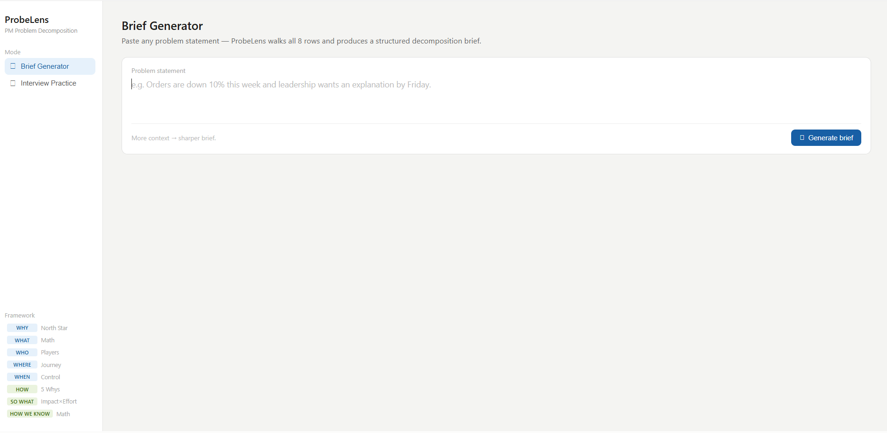
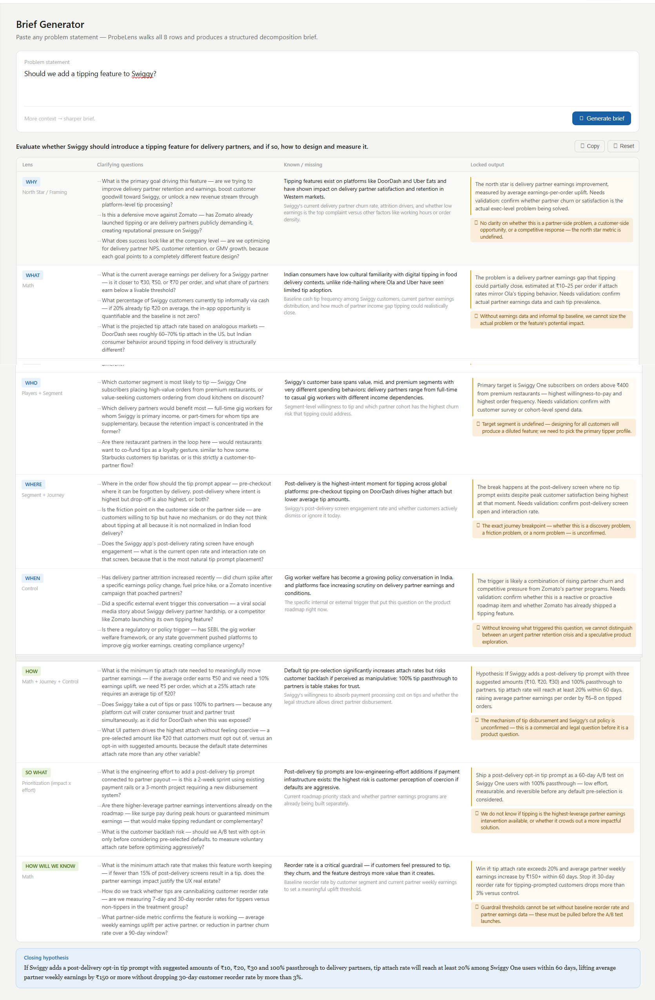
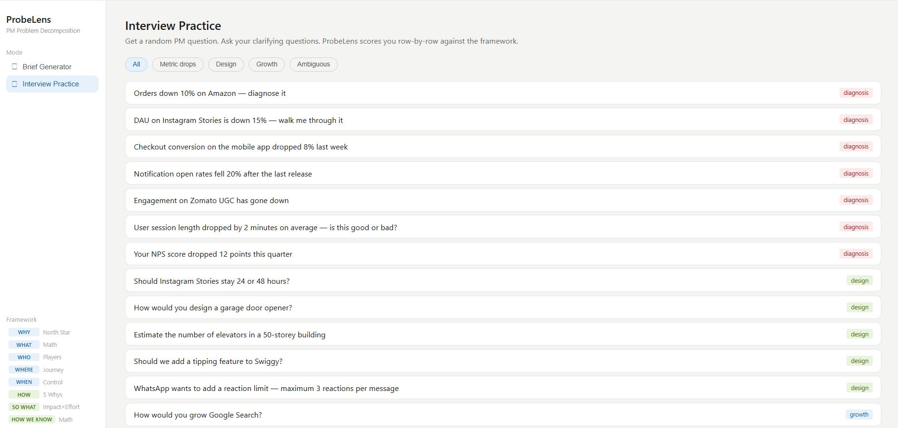
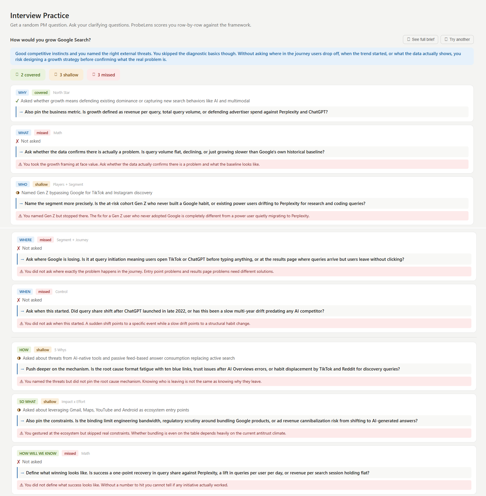

# ProbeLens — PM Problem Decomposition Tool

> An AI-powered tool that walks any product problem through a structured 8-row first-principles framework — generating clarifying questions, flagging gaps, and producing a locked one-page decomposition brief.

**Live tool:** [rishendra125.github.io/probeLens_project](https://rishendra125.github.io/probeLens_project/)

> To use the tool, you need a free Anthropic API key. Get one at [console.anthropic.com](https://console.anthropic.com) — paste it into the key screen on first open. Your key stays in your browser only and is never stored on any server.

---

## What it does

ProbeLens has two modes:

**Brief Generator** — Paste any problem statement. The AI walks all 8 rows of the framework sequentially, produces clarifying questions for each row, flags information gaps, and outputs a locked decomposition brief with a closing falsifiable hypothesis.




**Interview Practice** — Get a random PM question from a bank of 18 questions across 4 categories. Ask your clarifying questions freely. ProbeLens scores your response row-by-row against the framework, flags what you missed and what a strong answer adds, and lets you compare your thinking against the full brief.




---

## The Framework

The 8-row first-principles framework behind ProbeLens. Rows 1–5 are problem decomposition. Rows 6–8 are solutioning.

| Row | Question | Knife to use | Locked output |
|---|---|---|---|
| **WHY** | Why does this matter? | North Star / Framing | A clear goal or north-star metric |
| **WHAT** | What exactly is the problem? | Math | A precise problem statement |
| **WHO** | Who is affected, and who is involved? | Players + Segment | The target user or segment |
| **WHERE** | Where does it happen? | Segment + Journey | The exact point where it breaks |
| **WHEN** | When did it start? | Control | Candidates for what triggered it |
| **HOW** | How does the system produce this result? | Math + Journey + Control | A falsifiable hypothesis |
| **SO WHAT** | What's the highest-leverage action given constraints? | Prioritization (impact × effort) | A decision to act on |
| **HOW WILL WE KNOW** | Did it work, and what could break? | Math | Success criteria and guardrails |

> **Design principle:** The HOW row is the gate between decomposition and solutioning. No solution discussion until a falsifiable hypothesis exists.

---

## Sample Output

**Problem statement:** *Notification open rates fell 20% after the last release.*

| Lens | Locked output |
|---|---|
| WHY | Protecting the downstream outcome that notification open rate proxies (likely retention or activation). Needs validation: confirm which business metric this directly impacts. |
| WHAT | Open rate dropped from an unknown baseline by ~20% (likely relative), affecting an unknown subset of notification types. Needs validation: confirm absolute figures and whether uniform or concentrated. |
| WHO | Most likely affected: users who updated to the new release on the dominant platform. Needs validation: segment by platform, user cohort, and notification type. |
| WHERE | Break point is most likely at lock screen display-to-tap. Needs validation: pull delivery rate and display rate separately to isolate whether users are not seeing or not tapping. |
| WHEN | The last release is the primary trigger candidate. Needs validation: overlay release rollout curve against open rate decline curve and cross-check notification-related changelog. |
| HOW | **Hypothesis:** A change in the last release altered notification delivery eligibility, send timing, or open-event instrumentation — and if reversed or patched, open rate will recover to within 5% of pre-release baseline within 7 days. |
| SO WHAT | Pull the notification-related changelog diff and delivery-to-open funnel breakdown today — collapses three candidates to one within 24 hours at near-zero cost. |
| HOW WILL WE KNOW | **Win if:** open rate recovers to within 5% of pre-release baseline within 7 days. **Stop if:** opt-out rate rises >3% or delivery rate drops >2% vs. pre-release levels. |

---

## Question Bank (Interview Practice)

### Product Diagnosis — metric drops
1. Orders down 10% on Amazon — diagnose it
2. DAU on Instagram Stories is down 15% — walk me through it
3. Checkout conversion on the mobile app dropped 8% last week
4. Notification open rates fell 20% after the last release
5. Engagement on Zomato UGC has gone down
6. User session length dropped by 2 minutes on average — is this good or bad?
7. Your NPS score dropped 12 points this quarter

### Product Design / Feature Decisions
8. Should Instagram Stories stay 24 or 48 hours?
9. How would you design a garage door opener?
10. Estimate the number of elevators in a 50-storey building

### Growth / Strategy
11. How would you grow Google Search?
12. Amazon enters the hyperlocal delivery business — how do you think about it?
13. Revenue from the free-to-paid conversion funnel is flat for 3 months
14. A new market launch shows 40% lower activation than projected

### Ambiguous / Open-ended
15. A key enterprise customer says the product is "too slow" — investigate

---

## Tech Stack

| Layer | Choice |
|---|---|
| Reasoning engine | Claude Sonnet 4.6 (Anthropic API) |
| Frontend | Single self-contained HTML artifact |
| Framework backbone | 8-row first-principles table embedded in system prompt |
| Deployment | Claude.ai artifact (no backend required) |

---

## Build Log

| Step | What was built |
|---|---|
| Step 1 | System prompt with full framework, operational rules, gap-flagging logic, and question bank |
| Step 2 | Brief Generator core loop — API call, JSON parsing, 8-row render |
| Step 3 | Table layout redesign — compact view, "Locked output" column, gap chips, section divider between decomposition and solutioning |
| Step 4 | Interview Practice mode — 18-question bank across 4 categories, free-form answer input, batch scoring engine, card-based row rubric, full brief comparison view |

### Step 4 detail — Interview Practice mode

**Question bank** — 18 questions across 4 categories: Metric drops, Design, Growth, Ambiguous. Filterable by category or random pick.

**Scoring engine** — after the user types their clarifying questions and hits Score me, the AI scores row by row against the framework and returns:
- Coverage per row: covered, shallow, or missed
- What the user asked — one line summary
- What a strong answer adds — one sharp sentence, named entities, binary options
- Common mistake flag — plain English, only shown when missed or shallow

**Verdict** — two to three plain English sentences at the top. Starts with what they did well, names the biggest gap, explains why it matters.

**Full brief comparison** — after scoring, user can hit "See full brief" to run the Brief Generator on the same question and compare their thinking to the full 8-row framework output.

**Style calibration** — scoring output follows the same fine-tuned style as the Brief Generator. Named entities throughout (Perplexity, ChatGPT, Blinkit, Zepto, TikTok, Reddit). No dash symbol. No jargon. Plain English mistake lines.

---

## How First-Principles Thinking Maps to Clarifying Questions

First-principles thinking and clarifying questions are the same thing — the framework just gives them a structure and an order so nothing gets skipped under pressure.

Without a framework, a PM under pressure jumps to HOW ("maybe it's a bug?") before understanding WHO, WHERE, or WHEN. The 8 rows enforce the right sequence: decompose fully before diagnosing, diagnose before deciding.

### The mental model

Each row is a lens. Each lens generates a specific class of clarifying question. The questions are different for every problem — but the lenses never change.

| Row | The lens | What class of question it generates |
|---|---|---|
| **WHY** | North Star / Framing | Questions that anchor the business goal before anything else |
| **WHAT** | Math | Questions that define the problem precisely — magnitude, baseline, denominator |
| **WHO** | Players + Segment | Questions that narrow the affected population — segment, cohort, persona |
| **WHERE** | Segment + Journey | Questions that locate the exact break point in the funnel or journey |
| **WHEN** | Control | Questions that identify the trigger — what changed and when |
| **HOW** | 5 Whys | Questions that build toward a falsifiable root-cause hypothesis |
| **SO WHAT** | Impact × Effort | Questions that force prioritization — leverage, effort, reversibility |
| **HOW WILL WE KNOW** | Math | Questions that pre-register success — metric, threshold, guardrails |

### Worked example — "Engagement on Zomato UGC has gone down"

This is a deliberately vague problem statement. Here is how first-principles thinking produces the right clarifying questions, row by row:

**WHY — anchor the goal first**
- Is UGC engagement a north-star metric or a proxy for GMV and order conversion?
- Which business outcome is most at risk — restaurant discovery, contributor retention, or ad revenue?

*Why these questions:* Before investigating anything, you need to know what "winning" looks like. If UGC engagement is a proxy for conversion, fixing engagement that doesn't move GMV is wasted effort.

**WHAT — define the problem precisely**
- What exactly is "UGC engagement" — reviews, photos, ratings, feed reactions, or all of the above?
- Is this a creation problem (fewer people posting) or a consumption problem (fewer people reading and reacting)?
- How big is the drop — 2% or 20%? Over what time period?

*Why these questions:* "Engagement gone down" is not a problem statement. A creation drop and a consumption drop have completely different root causes and fixes. Math forces you to name the number before chasing it.

**WHO — narrow the segment**
- Is the drop among content creators (reviewers, photo uploaders) or content consumers (readers, reacters)?
- Is it concentrated in Tier-1 cities, a specific cuisine category, or a user tenure cohort?
- Are power contributors churning or is it casual UGC that's dropping?

*Why these questions:* Without segment narrowing, any fix is aimed at everyone and optimized for no one. Power contributor churn is a different problem from casual consumer disengagement.

**WHERE — find the exact break point**
- At which surface does the drop manifest — restaurant detail page, explore feed, or post-order review prompt?
- Is it device-specific (Android vs. iOS) or content-type-specific (text vs. photos)?

*Why these questions:* The restaurant detail page, the post-order nudge, and the explore feed have different intent, different audiences, and different fixes. You cannot design a solution until you know which surface is leaking.

**WHEN — find the trigger**
- Did this start suddenly (step-down on a specific date) or gradually (multi-week drift)?
- Did anything ship recently — review prompt UI, ranking algorithm, content policy, or incentive removal?
- Did Swiggy or a competitor change their UGC mechanics around the same time?

*Why these questions:* Sudden = something changed, look at the changelog. Gradual = behavioral shift, look at cohort trends. This single question halves your investigation path.

**HOW — form the hypothesis**
- Has the UGC surfacing algorithm changed, reducing visibility of fresh reviews on the restaurant detail page?
- Has post-order review submission rate dropped, making visible content go stale?
- Did a UI change collapse reviews below the fold, reducing tap-through surface area?

*Why these questions:* Only now — after WHO, WHERE, and WHEN are scoped — can you build a falsifiable hypothesis. The hypothesis here is: *a change to UGC ranking on the RDP reduced visibility of recent reviews, causing consumer disengagement.*

**SO WHAT — decide the action**
- Can we A/B test a surfacing algorithm revert within the next two sprints?
- Is there a parallel low-effort UI fix (re-expanding reviews above the fold) worth shipping as a hedge?

*Why these questions:* Impact × effort forces you to separate the fastest fix from the most complete fix and ship both in parallel rather than waiting for the perfect solution.

**HOW WILL WE KNOW — pre-register success**
- Win if: UGC interaction rate on the restaurant detail page recovers ≥15% vs. control within 14 days.
- Stop if: order conversion rate drops more than 2% or post-order review submission rate drops more than 5%.

*Why these questions:* Pre-registering the win condition and the guardrails before the experiment runs removes confirmation bias from the read-out.

---

### The key insight

The clarifying questions **are** the first-principles thinking. The framework does not teach you new questions — it ensures you ask the right questions in the right order, every time, under any pressure.

A PM who skips WHO and WHERE and jumps straight to HOW will diagnose the wrong segment at the wrong surface and build the wrong fix. The 8 rows are the guard rails that prevent that.

---


## Fine-Tuning — Clarifying Question Style

The AI's clarifying questions were calibrated using 7 real PM problem samples written by the author. These serve as few-shot examples embedded directly in the system prompt.

### What the calibration changed

Before calibration the questions were correct but read like written analysis — generic, formal, consultant-style. After calibration they match how a sharp PM actually speaks in a room or an interview.

**Before:**
> "Is there a specific failure rate or customer complaint data that defines 'broken' today?"

**After:**
> "What is the product usage pattern of churned customers in their last 30 days — are they disengaging gradually or are they active right up until cancellation, suggesting a pricing or ROI objection rather than a usage problem?"

### The 5 style rules derived from the samples

**1. Use a dash before options, not a colon**
> "What is the time period — is it today, this week or last quarter?"

**2. Name real entities, not generic categories**
> "If Flipkart and Meesho are also down, the cause is external" — not "if competitors are also affected"
> "Are users switching to TikTok, Reddit or ChatGPT?" — not "alternative platforms"

**3. Add inline reasoning when it changes the stakes**
> "A sudden drop points to a technical issue while a gradual decline points to a strategic or market problem."
> "This directly determines how many elevators are needed to meet that standard."

**4. Challenge the premise when relevant**
> "Are most stories already watched within the first 6 hours, making 48 hours largely irrelevant?"
> "Is this churn voluntary or contractual — are customers actively cancelling or are these monthly contracts that simply lapse?"

**5. One or two sentences maximum — no sub-clauses, no parenthetical lists**

### The 7 seed samples used as few-shot examples

| Problem | Key style element demonstrated |
|---|---|
| Estimate elevators in a 50-storey building | Inline reasoning — "because peak traffic patterns are completely different for each" |
| Orders down 10% on Amazon | Premise challenge — "if Flipkart and Meesho are also down the cause is external" |
| Should Instagram Stories stay 24 or 48 hours | Data challenge — "are most stories already watched within 6 hours, making 48 hours irrelevant?" |
| Amazon enters hyperlocal business | Named entities — "Blinkit and Zepto", "Bangalore or a smaller city to pilot and scale" |
| How would you grow Google Search | Named alternatives — "TikTok, Reddit or ChatGPT for certain searches instead" |
| Engagement on Zomato UGC gone down | Creation vs consumption framing — "are fewer users posting or are existing reviews getting less views?" |
| Design a garage door opener | Binary framing — "convenience, security or remote access for people who forget to close their garage?" |

---

## Framework Design Notes

- **"Knife to use"** names the analytical lens for each row — not a metaphor, a specific method (Math, Control, 5 Whys, etc.)
- **WHY knife** is North Star / Framing — not "None", because the most important row deserves the most explicit tool
- **HOW walk-away** is a falsifiable hypothesis — this is the gate that separates diagnosis from solution
- **SO WHAT question** is reframed around constraints and leverage, not just "what to do first"
- **Hidden column** — "Common PM mistake" is embedded in the system prompt for scoring logic but never shown to the user

---

## Tech Stack

| Layer | Choice |
|---|---|
| Reasoning engine | Claude Sonnet 4.6 (Anthropic API) |
| Frontend | Single self-contained HTML file |
| Framework backbone | 8-row first-principles table embedded in system prompt |
| API key handling | User-supplied key stored in browser localStorage only |
| Hosting | GitHub Pages — no backend, no server, no build step |

---

## How to use

1. Open [rishendra125.github.io/probeLens_project](https://rishendra125.github.io/probeLens_project/)
2. Get a free Anthropic API key at [console.anthropic.com](https://console.anthropic.com)
3. Paste your key into the screen on first open
4. Choose Brief Generator or Interview Practice and start

Your API key never leaves your browser. Each user pays for their own API usage — casual use costs less than $0.10.

---

## File Layout

```
probelens/
├── README.md                          # This file
├── index.html                         # Redirect to public version
├── probelens_public.html              # Live public tool with API key screen
├── probelens_system_prompt.md         # System prompt source — framework backbone
└── screenshots/
    ├── brief_generator_layout.png     # Brief Generator empty state
    ├── brief_generator_sample.png     # Brief Generator full output
    ├── interview_practice_layout.png  # Interview Practice question list
    └── interview_practice_sample.png  # Interview Practice score output
```

All logic, UI, and API calls live in a single `probelens_public.html` file. No backend, no dependencies, no build step.

---

## Author

**Rishendra Vikram Singh**
Senior Consultant — SPRAC Services Pvt. Ltd.
PMP · PMI-ACP · A-CSM · Microsoft Dynamics 365 CE · Microsoft Agentic AI Business Solutions Architect

[Portfolio](https://rishendra125.github.io) · [LinkedIn](https://linkedin.com/in/rishendra-vikram-singh-a7355718a/)

